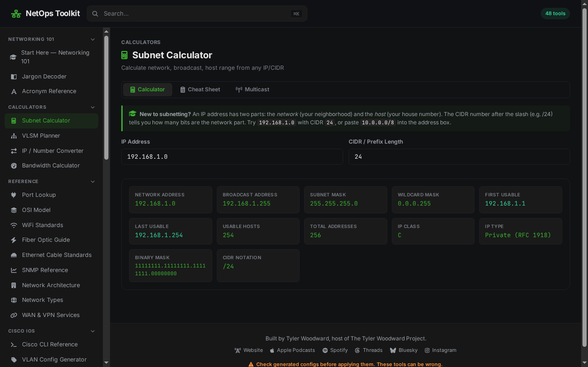

<p align="center">
  
</p>

<p align="center">
  Calculators, config generators and reference sheets for network engineers.<br>
  Subnetting, Cisco IOS configs, port and protocol lookups, and a broadcast/AoIP section for Livewire and AES67.
</p>

<p align="center">
  <a href="#"></a>
  <a href="package.json"></a>
  <a href="package.json"></a>
  <a href="https://astro.build"></a>
  <a href="https://svelte.dev"></a>
  <a href="LICENSE"></a>
</p>

<p align="center">
  <a href="#what-it-does">What it does</a> ·
  <a href="#run-your-own">Run your own</a> ·
  <a href="#make-it-yours">Make it yours</a> ·
  <a href="#build-and-deploy">Deploy</a> ·
  <a href="#adding-a-tool">Add a tool</a> ·
  <a href="#made-by">Made by</a>
</p>

> [!WARNING]
> **NetOps Toolkit is in active development and changes often.** Tools are still being ported over from an older single-script site, so expect rough edges and changes between versions. Check any generated config before you apply it, and please open an issue if something is wrong.

<p align="center">
  
</p>

## What it does

A static site built with [Astro](https://astro.build), [Tailwind CSS](https://tailwindcss.com) and [Svelte](https://svelte.dev). Every tool runs in your browser.

🧮 **Calculators**

Subnetting, VLSM planning, IP and number conversion, bandwidth. Results update as you type

⌨️ **Cisco IOS config generators**

VLAN, VRF, ACL, OSPF, BGP, DMVPN, VXLAN and more, plus a CLI reference

📚 **References**

Ports and protocols, the OSI model, WiFi, fiber and Ethernet cabling, SNMP, WAN services, a glossary and acronym list

🔐 **Security**

Attack references, a security checklist, and password and RSA key generators that run locally

🎙️ **Broadcast and AoIP**

Livewire and AES67: LWRP, multicast, ports and bandwidth

🔒 **Private by default**

Nothing is sent to a server except by the IP Checker, which you can turn off. A strict Content Security Policy (`script-src 'self'`) with no inline code

🍴 **Forkable**

Rename it, recolor it, hide categories and add your own links from one small config file

## Run your own

```sh
git clone <this repo> netops-toolkit && cd netops-toolkit
npm ci
npm run dev          # http://localhost:4321
```

### Make it yours

Don't edit `toolkit.config.ts`. Create `toolkit.config.local.ts` next to it
(it is gitignored) with only the settings you want to change:

```ts
import { defineLocalToolkit } from './src/lib/toolkit-schema';

export default defineLocalToolkit({
  name: 'Acme NetOps',
  icon: 'tower-cell', // any Font Awesome Free icon; 'brands:github' for brand icons
  accent: '#2f7cf6',
  site: 'https://tools.example.com',
  footer: {
    note: 'Run by the Acme network team.',
    links: [{ label: 'Acme', href: 'https://example.com', icon: 'building' }],
  },
  categories: { broadcast: false }, // hide a whole category
  externalLookups: false, // drop the IP Checker; the site then makes no third-party requests
});
```

| Setting           | What it does                                                                                                             |
| ----------------- | ------------------------------------------------------------------------------------------------------------------------ |
| `name`, `tagline` | Header, page titles, share cards, web manifest                                                                           |
| `icon`            | Logo and favicon. A [Font Awesome Free](https://fontawesome.com/search?ic=free) name; an unknown name fails the build    |
| `accent`          | Theme color for buttons, links, highlights and the favicon                                                               |
| `site`            | Canonical URL, used by the sitemap and share links                                                                       |
| `footer`          | A line of text and a list of links, each with an optional icon                                                           |
| `categories`      | `net101`, `calculators`, `reference`, `cisco`, `security`, `operations`, `broadcast`; set any to `false` to leave it out |
| `externalLookups` | `false` removes tools that call third-party services                                                                     |
| `indexable`       | `false` serves a robots.txt that refuses crawlers, e.g. for a staging copy                                               |

## Build and deploy

```sh
tools/build          # type-check, build into .build/, verify
tools/publish        # the same into .releases/<stamp>/, then point `dist` at it
```

Serve the `dist` symlink as a static site. `tools/publish` swaps it only after
the build and verification pass, so a broken build never goes live.
`deploy/nginx.conf.example` is a starting point for nginx, with the Content
Security Policy the site is built for.

`tools/verify.mjs` fails a build that contains any inline script, style or
event handler, because the site is meant to run under `script-src 'self'` and
`style-src 'self'`. It also checks that exactly the enabled tools have pages.

## Adding a tool

1. Add it to `src/data/tools.ts`: id, name, description, Font Awesome icon,
   category and search tags.
2. Create `src/tools/<id>/index.astro`. Static reference content is plain
   Astro. For anything interactive, write a Svelte component, render it inside
   `<div data-island="<id>" data-ssr>`, and start it from a `<script>` with
   `start()` from `src/lib/mount.ts` (see `src/tools/subnet-calc/`). Don't use
   Astro's `client:*` directives: they add an inline script the CSP blocks.
3. Use the shared classes in `src/styles/global.css` (`panel`, `tip`,
   `ref-table`, `result-grid`, `form-input`, `btn`…) and Tailwind utilities,
   never `style=""`.

## Made by

NetOps Toolkit is made by **Tyler Woodward**, host of the podcast [**The Tyler Woodward Project**](https://tylerwoodward.me).

[](https://tylerwoodward.me) [](https://www.facebook.com/thetylerwoodwardproject) [](https://www.threads.net/@tylerwoodward.me) [](https://www.instagram.com/tylerwoodward.me)

## Licence

MIT © 2026 [Tyler Woodward](https://tylerwoodward.me). See [LICENSE](LICENSE). Icons are [Font Awesome Free](https://fontawesome.com/license/free) (CC BY 4.0).
